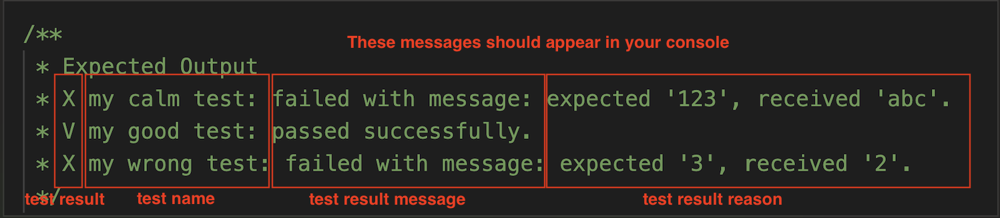

# Building Jest Yourself 🤡

Please follow the guidance and instructions before start writing any code.

# Table of Contents

* [requirements](#requirements)
   * [implementation hints](#the-test-expect-and-tobe-signature-hints)
   * [the code](#the-code)
   * [output explained](#output-explained)


# Requirements

The Jest framework provides out-of-the-box many utility functions, that when we run test files with Jest, we assume Jest will provide an implementation for us, some examples of these utilities are the `test`, `expect` and `.toBe` functions.

Today, you mission is to implement these 3 utilities.

## The `test`, `expect`, and `.toBe` signature hints

* Defining a new test - `function test(testName, testFn) { ... }`
* Define the expected value, a single test supports multiple `expect`s declarations. - `function expect(expectedValue) { ... }` - 
* match the actual value received with the expected value. - `.toBe(actualValue) { ... }`

## The code

The following code is already available for you in this [link](https://www.programiz.com/online-compiler/7LhdzaRJkSTcf), or you can copy the following code to this [online editor](https://www.programiz.com/javascript/online-compiler/).

```ts

/**
 * This part demonstrates the "jest" framework implementation: test, expect, .toBe
 */

function test(testName, testFn) { 
   // add your implementation
   throw new Error("Not implemented.");
}

function expect(expectedValue) {
   // add your implementation
   throw new Error("Not implemented.");
}

/**
 * This part demonstrates the test file
 * 🚧 you should NOT touch the code below 🚧
 */ 

test('my calm test', () => {
   expect('123').toBe('abc');
})

test('my good test', () => {
   expect(2).toBe(2)
   expect(2).toBe(2)
})

test('my wrong test', () => {
   expect(3).toBe(3)
   expect(3).toBe(2)
})

/**
 * Expected Output 
 * X my calm test: failed with message: expected '123', received 'abc'.
 * V my good test: passed successfully.
 * X my wrong test: failed with message: expected '3', received '2'.
 */
```

## Output Explained

